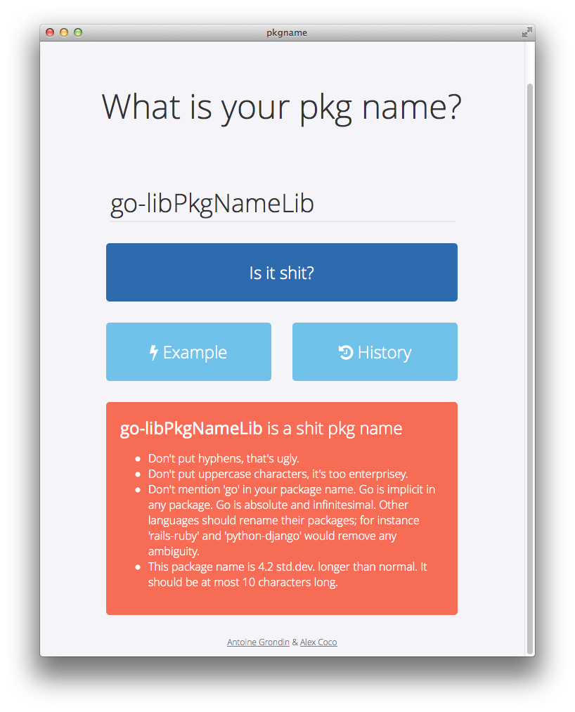

# pkgname
> Is the name of my package shit?

Using a variety of very advanced heuristic engines, `pkgname` tells if your
idea for a Go package name is shit.

# Authors

[Antoine Grondin][antoine] and [Alexander Coco][coco]

## Data

The data used for the bank of sample package names is built from the Github API,
querying for Go repositories with more than 50 stars, and cleaned up to remove
shit names.

## License

MIT license.

[antoine]:https://twitter.com/AntoineGrondin
[coco]:https://twitter.com/_alexcoco
